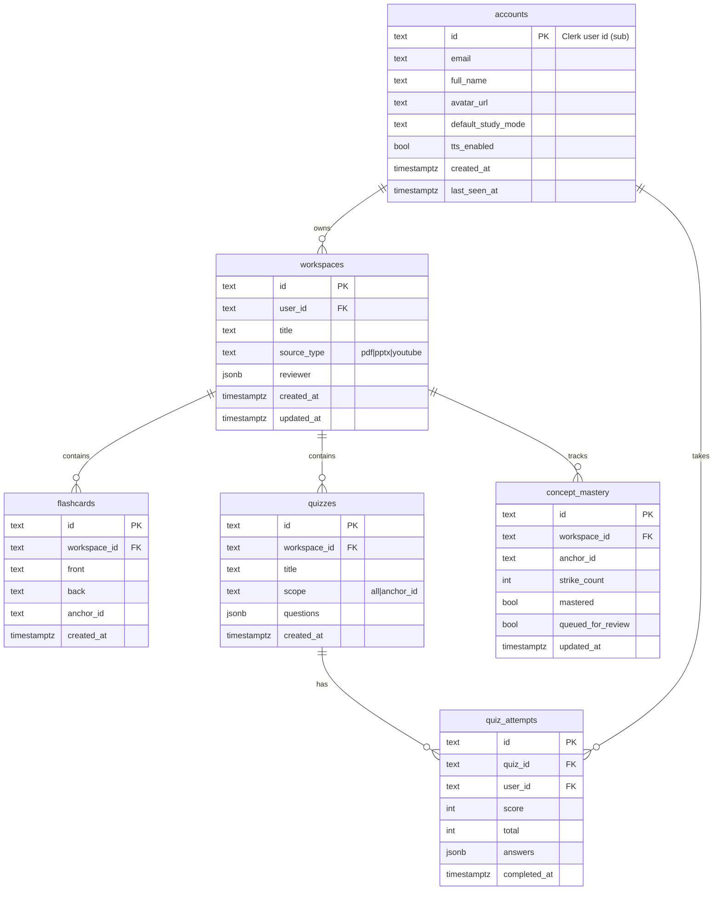

# 📄 PRISM LEARNING AI
## Document 6: Database Architecture (PRD)

This document defines the PostgreSQL (Supabase) data model — user **accounts**, workspaces,
generated content, and assessment/progress tracking — plus Row Level Security, the
Clerk↔Supabase identity flow, and per-table implementation status.

> The canonical DDL lives at `backend/app/db/schema.sql`. This document is the design of
> record; the SQL file tracks the subset currently deployed.

---

### 1. DESIGN PRINCIPLES

1. **Clerk owns identity; Postgres owns application data.** Authentication (passwords, OAuth,
   sessions, MFA) is fully delegated to Clerk. Our `accounts` table is a **local mirror** of
   the Clerk user, keyed by the Clerk user id (`sub` claim), holding only the email/name we
   are permitted to store plus app-level preferences.
2. **Everything is user-scoped.** Every row traces back to an owning account, and Row Level
   Security enforces that a user can only read/write their own rows.
3. **Zero-retention for source files.** Uploaded PDFs/PPTs/videos are never stored. Only the
   *derived* Master Reviewer JSON is persisted (`workspaces.reviewer`).
4. **JSONB for AI payloads.** Reviewer documents and quiz questions are stored as `jsonb` —
   they already match strict Pydantic/TypeScript contracts, so the DB stays flexible while
   the application layer enforces shape.
5. **Text primary keys.** Ids are `uuid4().hex` strings generated by the backend (matching
   the current repository code), except `accounts.id`, which is the Clerk user id verbatim.

---

### 2. ENTITY RELATIONSHIP OVERVIEW



---

### 3. TABLES

#### 3.1 `accounts` — user profiles *(status: PLANNED — enables Clerk sync)*
A local mirror of the Clerk user. Populated/updated by a Clerk webhook (see §5); never the
source of truth for credentials.

| Column | Type | Notes |
|--------|------|-------|
| `id` | `text` PK | Clerk user id (the JWT `sub` claim), e.g. `user_2ab...` |
| `email` | `text` | From the user's Google account (only PII collected) |
| `full_name` | `text` | Display name |
| `avatar_url` | `text` | Optional profile image URL from Clerk |
| `default_study_mode` | `text` | `technical` \| `conceptual` \| `comprehensive`; default `comprehensive` |
| `tts_enabled` | `bool` | Persisted TTS preference; default `false` |
| `created_at` | `timestamptz` | Row creation |
| `last_seen_at` | `timestamptz` | Updated on activity |

#### 3.2 `workspaces` — isolated study environments *(status: IMPLEMENTED)*
One row per ingested source. `reviewer` holds the full `[MODE: INGEST]` payload
(`table_of_contents` + anchored `markdown_content`).

| Column | Type | Notes |
|--------|------|-------|
| `id` | `text` PK | `uuid4().hex` |
| `user_id` | `text` FK → `accounts.id` | Owner (Clerk id) |
| `title` | `text` | Derived from filename / source |
| `source_type` | `text` | `CHECK IN ('pdf','pptx','youtube')` |
| `reviewer` | `jsonb` | The Master Reviewer document |
| `created_at` | `timestamptz` | |
| `updated_at` | `timestamptz` | *(planned — for reviewer edits)* |

#### 3.3 `flashcards` — spawned study cards *(status: IMPLEMENTED)*
Created when Lumi sets `widget_trigger: "flashcard"`, or manually. Exported as printable
cut-out squares.

| Column | Type | Notes |
|--------|------|-------|
| `id` | `text` PK | |
| `workspace_id` | `text` FK → `workspaces.id` ON DELETE CASCADE | |
| `front` | `text` | Term / question |
| `back` | `text` | Answer |
| `anchor_id` | `text` NULL | Links back to a concept in the reviewer |
| `created_at` | `timestamptz` | |

#### 3.4 `quizzes` — generated assessments *(status: PLANNED — currently generated on-demand, not persisted)*
Persisting quizzes enables retakes, sharing, and history. `questions` is the `[MODE: QUIZ]`
payload (array of typed questions).

| Column | Type | Notes |
|--------|------|-------|
| `id` | `text` PK | |
| `workspace_id` | `text` FK → `workspaces.id` ON DELETE CASCADE | |
| `title` | `text` | |
| `scope` | `text` | `all` or a concept `anchor_id` |
| `questions` | `jsonb` | mcq / true_false / fill_blank / short_answer |
| `created_at` | `timestamptz` | |

#### 3.5 `quiz_attempts` — score history *(status: PLANNED)*
One row per completed quiz run; powers progress analytics.

| Column | Type | Notes |
|--------|------|-------|
| `id` | `text` PK | |
| `quiz_id` | `text` FK → `quizzes.id` ON DELETE CASCADE | |
| `user_id` | `text` FK → `accounts.id` | |
| `score` | `int` | Correct count |
| `total` | `int` | Question count |
| `answers` | `jsonb` | Per-question responses |
| `completed_at` | `timestamptz` | |

#### 3.6 `concept_mastery` — spaced repetition & stepper state *(status: PLANNED)*
Backs the PRD's **3-Strike Rule** (Doc 1 §3): a concept failed 3× is flagged and pushed to
the end of the queue. Persists per-concept progress so the tutor stepper survives reloads.

| Column | Type | Notes |
|--------|------|-------|
| `id` | `text` PK | |
| `workspace_id` | `text` FK → `workspaces.id` ON DELETE CASCADE | |
| `anchor_id` | `text` | Concept identifier from the reviewer |
| `strike_count` | `int` | Current consecutive failures; default `0` |
| `mastered` | `bool` | Concept passed; default `false` |
| `queued_for_review` | `bool` | Moved to end of queue (spaced repetition); default `false` |
| `updated_at` | `timestamptz` | |

`UNIQUE (workspace_id, anchor_id)` — one mastery row per concept per workspace.

---

### 4. INDEXES

```sql
create index workspaces_user_id_idx      on public.workspaces (user_id);
create index flashcards_workspace_id_idx on public.flashcards (workspace_id);
create index quizzes_workspace_id_idx    on public.quizzes (workspace_id);
create index quiz_attempts_user_id_idx   on public.quiz_attempts (user_id);
create index quiz_attempts_quiz_id_idx   on public.quiz_attempts (quiz_id);
create unique index concept_mastery_uq   on public.concept_mastery (workspace_id, anchor_id);
```

---

### 5. IDENTITY: CLERK ↔ SUPABASE

1. **Sign-in** is handled entirely by Clerk (Google OAuth). Clerk issues a JWT whose `sub`
   claim is the user id.
2. **Account sync** — a Clerk webhook (`user.created` / `user.updated` / `user.deleted`,
   verified via Svix signature) hits a backend endpoint that upserts/deletes the matching
   `accounts` row. This keeps email/name current without storing credentials.
3. **API requests** — the frontend sends the Clerk session JWT as a `Bearer` token. FastAPI
   verifies it against `CLERK_JWKS_URL` and extracts `sub` as the `user_id` used for all
   queries.

   > **Current state:** verification is stubbed in `backend/app/core/auth.py` — it reads an
   > `X-User-Id` header (default `dev-user`). Swapping in real Clerk verification is a
   > drop-in change to that single dependency.
4. **Direct client access** (if the browser ever queries Supabase directly) is protected by
   RLS using the Clerk-integrated `auth.jwt() ->> 'sub'`.

---

### 6. ROW LEVEL SECURITY

RLS is enabled on every table. The backend uses the **service-role key** (which bypasses
RLS) and *additionally* filters by `user_id` in code as defense-in-depth; the policies below
protect any direct client access.

```sql
-- accounts: a user sees only their own profile
alter table public.accounts enable row level security;
create policy accounts_self on public.accounts
    for all using (id = auth.jwt() ->> 'sub')
            with check (id = auth.jwt() ->> 'sub');

-- workspaces: owner-only
alter table public.workspaces enable row level security;
create policy workspaces_owner on public.workspaces
    for all using (user_id = auth.jwt() ->> 'sub')
            with check (user_id = auth.jwt() ->> 'sub');

-- child tables: owner of the parent workspace
alter table public.flashcards enable row level security;
create policy flashcards_owner on public.flashcards
    for all using (exists (
        select 1 from public.workspaces w
        where w.id = flashcards.workspace_id
          and w.user_id = auth.jwt() ->> 'sub'));

alter table public.quizzes enable row level security;
create policy quizzes_owner on public.quizzes
    for all using (exists (
        select 1 from public.workspaces w
        where w.id = quizzes.workspace_id
          and w.user_id = auth.jwt() ->> 'sub'));

alter table public.concept_mastery enable row level security;
create policy concept_mastery_owner on public.concept_mastery
    for all using (exists (
        select 1 from public.workspaces w
        where w.id = concept_mastery.workspace_id
          and w.user_id = auth.jwt() ->> 'sub'));

-- quiz_attempts: the attempting user
alter table public.quiz_attempts enable row level security;
create policy quiz_attempts_owner on public.quiz_attempts
    for all using (user_id = auth.jwt() ->> 'sub')
            with check (user_id = auth.jwt() ->> 'sub');
```

---

### 7. FULL DDL (target schema)

```sql
create extension if not exists "pgcrypto";

-- ── accounts (Clerk mirror) ─────────────────────────────────────────────────
create table if not exists public.accounts (
    id                 text primary key,          -- Clerk user id (sub)
    email              text not null,
    full_name          text,
    avatar_url         text,
    default_study_mode text not null default 'comprehensive'
                       check (default_study_mode in ('technical','conceptual','comprehensive')),
    tts_enabled        boolean not null default false,
    created_at         timestamptz not null default now(),
    last_seen_at       timestamptz not null default now()
);

-- ── workspaces ──────────────────────────────────────────────────────────────
create table if not exists public.workspaces (
    id          text primary key,
    user_id     text not null references public.accounts (id) on delete cascade,
    title       text not null,
    source_type text not null check (source_type in ('pdf','pptx','youtube')),
    reviewer    jsonb not null,
    created_at  timestamptz not null default now(),
    updated_at  timestamptz not null default now()
);

-- ── flashcards ──────────────────────────────────────────────────────────────
create table if not exists public.flashcards (
    id           text primary key,
    workspace_id text not null references public.workspaces (id) on delete cascade,
    front        text not null,
    back         text not null,
    anchor_id    text,
    created_at   timestamptz not null default now()
);

-- ── quizzes ─────────────────────────────────────────────────────────────────
create table if not exists public.quizzes (
    id           text primary key,
    workspace_id text not null references public.workspaces (id) on delete cascade,
    title        text not null,
    scope        text not null default 'all',
    questions    jsonb not null,
    created_at   timestamptz not null default now()
);

-- ── quiz_attempts ───────────────────────────────────────────────────────────
create table if not exists public.quiz_attempts (
    id           text primary key,
    quiz_id      text not null references public.quizzes (id) on delete cascade,
    user_id      text not null references public.accounts (id) on delete cascade,
    score        integer not null,
    total        integer not null,
    answers      jsonb not null default '[]'::jsonb,
    completed_at timestamptz not null default now()
);

-- ── concept_mastery ─────────────────────────────────────────────────────────
create table if not exists public.concept_mastery (
    id                 text primary key,
    workspace_id       text not null references public.workspaces (id) on delete cascade,
    anchor_id          text not null,
    strike_count       integer not null default 0,
    mastered           boolean not null default false,
    queued_for_review  boolean not null default false,
    updated_at         timestamptz not null default now(),
    unique (workspace_id, anchor_id)
);
```

---

### 8. IMPLEMENTATION STATUS

| Table | Status | Where |
|-------|--------|-------|
| `workspaces` | ✅ Implemented | `db/schema.sql`, `db/memory.py`, `db/supabase_repo.py` |
| `flashcards` | ✅ Implemented | same |
| `concept_mastery` | ✅ Implemented | same + `routers/gamification.py` (schema uses `strength`/`strikes`/`mastered`, PK `(workspace_id, anchor_id)`) |
| `player_profiles` | ✅ Implemented | XP + streak + daily quests; `GET/PATCH /profile` (not in the original ERD — added alongside `concept_mastery`) |
| `accounts` | ⬜ Planned | needs Clerk webhook + `db/schema.sql` addition |
| `quizzes` | ⬜ Planned | quizzes currently generated on-demand, not persisted |
| `quiz_attempts` | ⬜ Planned | client-side scoring today |

> **Note:** the deployed `backend/app/db/schema.sql` now defines `workspaces`, `flashcards`,
> `player_profiles`, and `concept_mastery`, all with RLS on `auth.jwt()->>'sub'`. The backend
> endpoints run against the in-memory repository until Supabase keys are configured; the
> frontend still uses its localStorage `prism_profile` / `prism_mastery_boost` and will POST to
> these endpoints once live. `workspaces.user_id` will gain its FK to `accounts` once the
> accounts table and Clerk sync are added.
